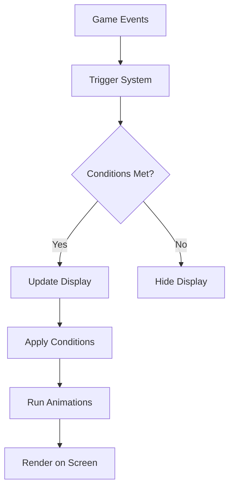

## Overview

WeakAuras is built as a modular framework for World of Warcraft that provides a powerful system for creating custom interface displays. Understanding its architecture will help you create more effective and efficient auras.

## Core Components

The WeakAuras framework consists of several key components that work together:

<CardGroup cols={2}>
  <Card title="Displays" icon="image" href="/core-concepts/displays">
    Visual elements that appear on screen (icons, bars, text, etc.)
  </Card>
  <Card title="Triggers" icon="bolt" href="/core-concepts/triggers/overview">
    Conditions that determine when displays should show or update
  </Card>
  <Card title="Conditions" icon="sliders" href="/core-concepts/conditions">
    Dynamic property changes based on game state
  </Card>
  <Card title="Animations" icon="wand-magic-sparkles" href="/core-concepts/animations">
    Visual effects and transitions for displays
  </Card>
</CardGroup>

## How WeakAuras Works

<Steps>
  <Step title="Event Registration">
    WeakAuras registers for game events based on your aura configurations. This efficient system only listens for events that your auras actually need.
    
    ```lua
    -- From WeakAuras.lua
    WeakAuras:RegisterEvent("PLAYER_ENTERING_WORLD")
    WeakAuras:RegisterEvent("PLAYER_LOGIN")
    ```
  </Step>

  <Step title="Trigger Evaluation">
    When events fire, WeakAuras evaluates your trigger conditions to determine if auras should show, hide, or update.
    
    <Note>WeakAuras uses an optimized scanning system to minimize CPU usage even with many active auras.</Note>
  </Step>

  <Step title="Display Updates">
    If trigger conditions are met, WeakAuras updates the corresponding displays with new data (texture, text, progress, etc.).
  </Step>

  <Step title="Condition Application">
    Dynamic conditions are applied to modify display properties in real-time based on additional criteria.
  </Step>

  <Step title="Animation Execution">
    Show/hide animations and transitions play according to your configuration.
  </Step>
</Steps>

## Data Flow



## Module Structure

WeakAuras is organized into several key modules:

### Core Module

The main WeakAuras module handles:
- Initialization and addon loading
- Event registration and dispatching
- Display lifecycle management
- Data persistence (SavedVariables)

```lua
-- Internal version tracking
local internalVersion = 87
```

### Region Types

Each display type has its own region implementation:

<Accordion title="Available Region Types">
  - **Icon** - Single texture with cooldown overlays
  - **AuraBar** - Progress bar with text labels
  - **Text** - Dynamic text displays
  - **Texture** - Custom textures and progress textures
  - **Group** - Container for multiple displays
  - **DynamicGroup** - Auto-arranging display groups
  - **Model** - 3D model displays
  - **StopMotion** - Animated texture sequences
</Accordion>

### Trigger Systems

Multiple trigger types provide flexibility:

- **BuffTrigger2** - Optimized aura/buff/debuff detection
- **GenericTrigger** - Handles combat events, status checks, and custom logic
- **BossMods** - Integration with DBM and BigWigs

### Supporting Systems

<CardGroup cols={3}>
  <Card title="Profiling" icon="gauge-high">
    Performance monitoring and CPU usage tracking
  </Card>
  <Card title="Modernize" icon="arrow-up">
    Automatic updates for old aura formats
  </Card>
  <Card title="Transmission" icon="share-nodes">
    Import/export and sharing functionality
  </Card>
</CardGroup>

## Performance Optimization

WeakAuras includes several performance optimizations:

### Conditional Loading

Auras can be configured to load only when needed:

```lua
-- Load conditions examples
load = {
  use_class = true,
  class = { ["WARRIOR"] = true },
  use_spec = true,
  spec = { [1] = true },  -- Only in spec 1
  use_zone = true,
  zone = "Icecrown Citadel"
}
```

### Event Filtering

The framework only registers for events that are actually used by active auras.

### Pooling System

Display frames are recycled rather than constantly created and destroyed:

```lua
-- From Pools.lua
local regionPools = {}
```

<Tip>Use load conditions to prevent unnecessary auras from running in irrelevant content.</Tip>

## Extension Points

WeakAuras provides several extension points for advanced users:

### Custom Triggers

Write Lua code for complex trigger logic:

```lua
function()
  -- Custom trigger code
  return true  -- Show aura
end
```

### Custom Code

Add init, trigger, and animation code:

- **Init** - Runs once when aura loads
- **Trigger** - Custom trigger evaluation
- **Actions** - Custom behavior on show/hide/update

### Region Type Registration

Developers can create custom region types:

```lua
WeakAuras.RegisterRegionType(regionType, constructor, default, properties)
```

## Data Storage

WeakAuras stores configuration in SavedVariables:

```lua
WeakAurasSaved = {
  displays = {},
  history = {},
  login_squelch_time = 10
}
```

<Warning>Always back up your WeakAurasSaved file before major changes!</Warning>

## Next Steps

<CardGroup cols={2}>
  <Card title="Learn About Displays" icon="image" href="/core-concepts/displays">
    Deep dive into display types and configuration
  </Card>
  <Card title="Understanding Triggers" icon="bolt" href="/core-concepts/triggers/overview">
    Master the trigger system for precise control
  </Card>
  <Card title="Groups & Organization" icon="layer-group" href="/core-concepts/groups">
    Organize multiple displays efficiently
  </Card>
  <Card title="Customization Options" icon="palette" href="/core-concepts/animations">
    Add animations, conditions, and custom code
  </Card>
</CardGroup>